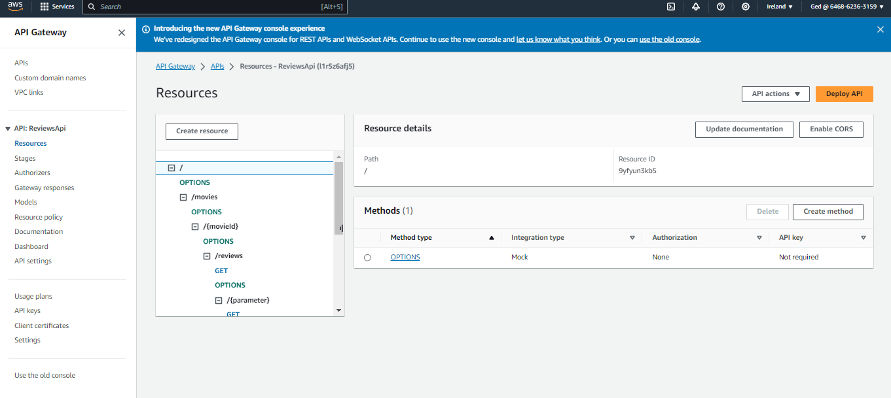
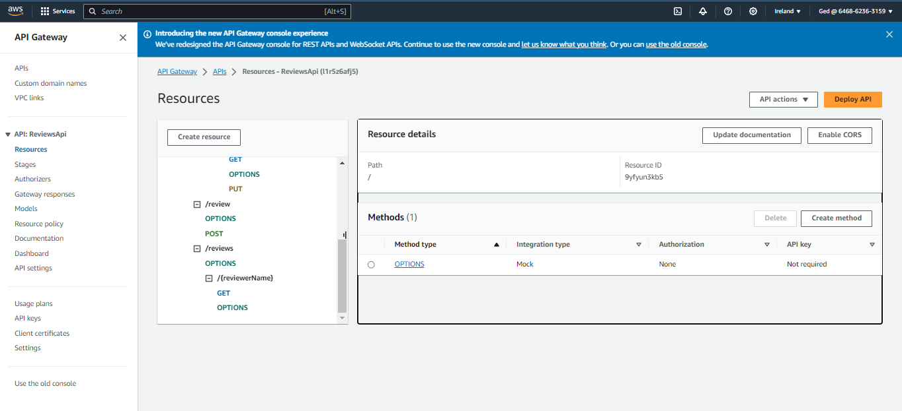
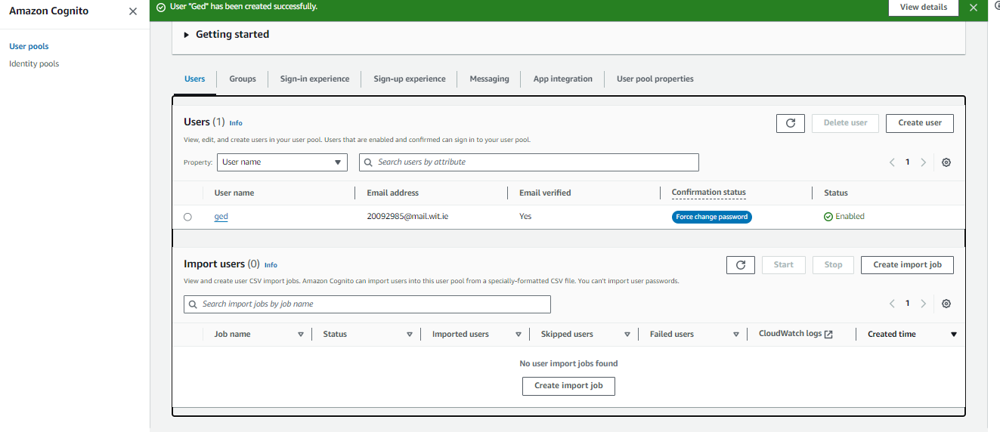

## ServerlessREST Sddignment - Distributed Systems.

__Name: Gedvydas Jucius

This repository contains the implementation of a serverless REST API for the AWS platform. A CDK stack creates the infrastructure. The domain context of the API is movie reviews.

### API endpoints.
 
+ POST /movies/reviews - add a movie review.
+ GET /movies/{movieId}/reviews - Get all the reviews for a movie with the specified id.
+ GET /movies/{movieId}/reviews?minRating=n - Get all the reviews for the movie with the specified ID with a rating greater than the minRating.
+ GET /movies/{movieId}/reviews/{reviewerName} - Get the review for the movie with the specified movie ID and written by the named reviewer.
+ PUT /movies/{movieId}/reviews/{reviewerName} - Update the text of a review. (movie ID and reviewer username uniquely identify a review item).
+ GET /movies/{movieId}/reviews/{year} - Get the review(s) for the movie with the specified movie ID and were written in a specified year.
+ GET /movies/reviews/{reviewerName} - Get all the reviews written by a specific reviewer.
+ GET /movies/{movieId}/reviews/{reviewerName}/translation?language=code - Get a translated version of the review for the movie with the specified movie ID and written by the named reviewer.


[Include screenshots from the AWS console (API Gateway service) that clearly show the deployed API ( have legible font size). ]





### Authentication..



### Independent learning (If relevant)

+ Researched DynamoDB commands, such as UpdateCommand and ScanCommand
    + Files for evidence:
        + lambdas/updateReview.ts
        + lambdas/getReviewsByReviewerName.ts

+ Researched DynamoDB filter expressions
    + Files of evidence:
        + lambdas/getMovieReviewsByMovieIdAndParameter.ts

+ Researched AWS Translate functionality
    + Files of evidence:
        + lambdas/getMovieReviewsByMovieIdAndParameter.ts

### Steps to run
Requirements: 
+ Node.js installed
+ AWS CDK configured

1. Clone the repository
2. Navigate to the directory in a terminal and run the following commands:

```
npm install
npm run schema
cdk deploy
```
